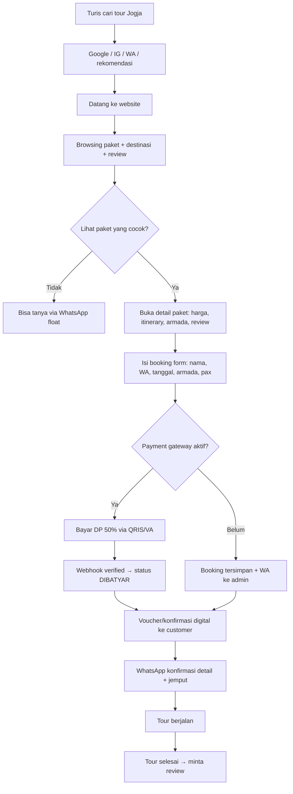
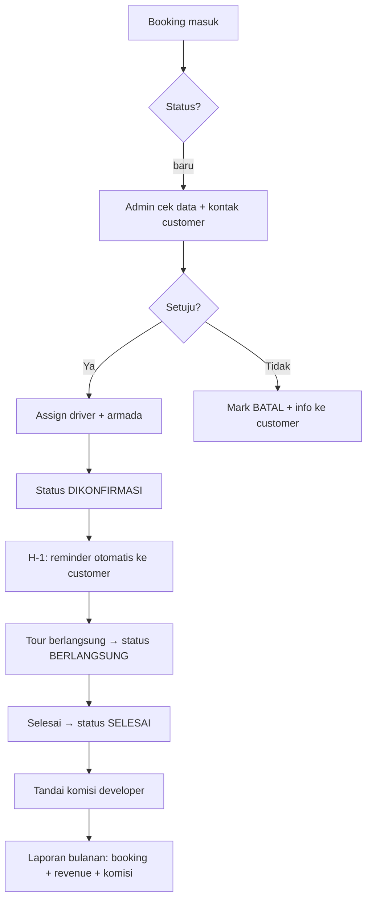
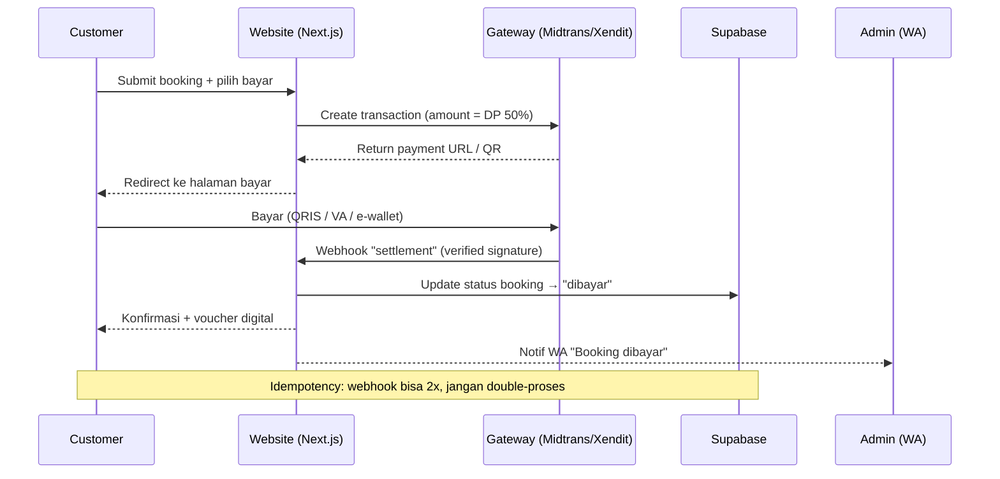
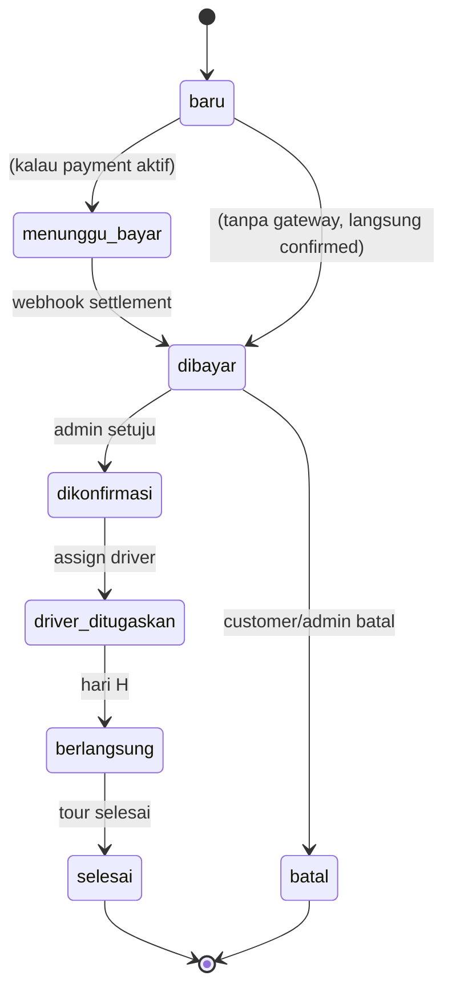
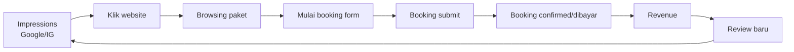
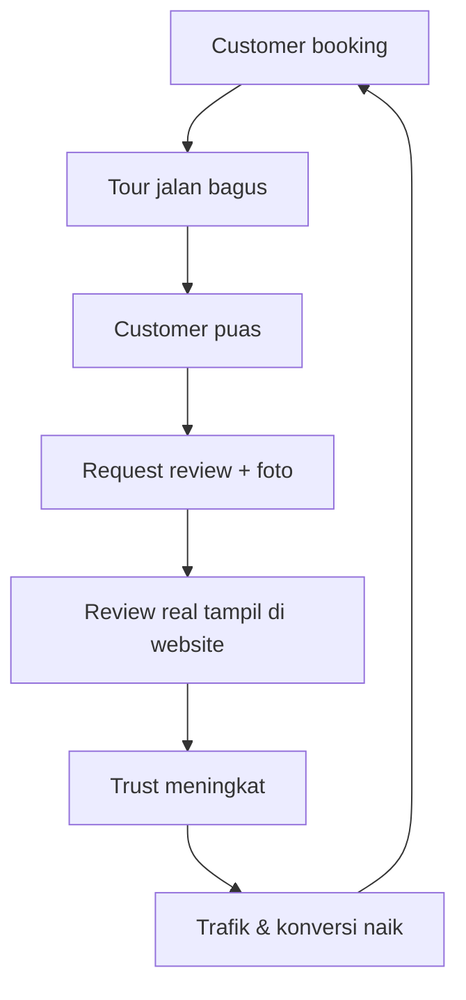

# Claris & City Tour Jogja — Business Model & Flow

> Status: v1.0 · Updated: 2026-08-30
> Dokumen pendamping `BUSINESS_PLAN.md` — fokus ke MODEL & FLOW lengkap.
> Baca `BUSINESS_PLAN.md` untuk roadmap & monetization detail.

---

## 1. Business Model Canvas (Ringkas)

| Blok                       | Isi                                                                                                                                          |
| -------------------------- | -------------------------------------------------------------------------------------------------------------------------------------------- |
| **Customer Segments**      | Turis domestik (target utama) · Turis asing · Wisata keluarga · Backpacker · Corporate/study tour                                            |
| **Value Proposition**      | Tour Jogja terstruktur + transparan + terpercaya. "Traveloka-nya tour operator Jogja" — modern, review asli, harga ALL-IN, booking confirmed |
| **Channels**               | Website (SEO) · Instagram · Google Maps · WhatsApp · Word of mouth · Blog SEO                                                                |
| **Customer Relationships** | WhatsApp CS (respon cepat) · Follow-up otomatis · Review collection · Membership (nanti)                                                     |
| **Revenue Streams**        | ① Komisi per booking (developer) ② Fee transaksi gateway ③ SaaS bulanan per operator (multi-tenant)                                          |
| **Key Resources**          | Website/backend · Database · Driver & armada (punya keponakan) · Brand "Claris & City" · Data customer                                       |
| **Key Activities**         | Booking management · Driver assignment · Marketing/SEO · Review management · Pembayaran                                                      |
| **Key Partnerships**       | Payment gateway (Midtrans/Xendit) · Driver/guide partner · Hotel/resto partner · Google                                                      |
| **Cost Structure**         | Domain (~Rp 200rb/thn) · Gateway fee (2-3% transaksi) · Hosting (free Vercel) · DB (free Supabase)                                           |

---

## 2. Alur Utama (Core Flows)

### 2.1 Flow Customer — Booking Tour



### 2.2 Flow Internal — Manajemen Booking (Admin/Operator)



### 2.3 Flow Payment (Fase 2)



---

## 3. Alur Data (Data Model & State)

### 3.1 Status Lifecycle Booking



### 3.2 Entitas (Schema)

```prisma
model Booking {
  id          Int      @id @default(autoincrement())
  name        String
  phone       String
  email       String?
  packageSlug String?
  vehicleName String?
  tourDate    String?
  pax         Int      @default(1)
  message     String?
  status      String   @default("baru") // baru | menunggu_bayar | dibayar | dikonfirmasi | driver_ditugaskan | berlangsung | selesai | batal
  commission  Int      @default(15000)  // komisi developer
  commissionPaid Boolean @default(false)
  paymentId   String?  // id transaksi gateway
  paymentMethod String? // QRIS / VA / e-wallet
  driverId    Int?
  driver      Driver?
  createdAt   DateTime @default(now())
}

model Driver {
  id        Int      @id @default(autoincrement())
  name      String
  phone     String
  photo     String?
  status    String   @default("tersedia") // tersedia | bertugas
  bookings  Booking[]
}

model Review {
  id         Int      @id @default(autoincrement())
  packageId  Int?
  package    TourPackage?
  name       String   // nama customer
  rating     Int      // 1-5
  comment    String
  verified   Boolean  @default(true) // cuma dari booking beneran
  createdAt  DateTime @default(now())
}
```

---

## 4. Revenue Model Detail

### 4.1 Tiga Aliran Revenue

| #   | Revenue Stream         | Cara                                   | Estimasi                  |
| --- | ---------------------- | -------------------------------------- | ------------------------- |
| 1   | **Komisi per booking** | Rp 15rb/booking sukses                 | 50 booking = Rp 750rb/bln |
| 2   | **Fee transaksi**      | 1-2% dari total transaksi (Fase 2)     | Scaling dgn volume        |
| 3   | **SaaS multi-tenant**  | Rp 200-500rb/bln per operator (Fase 3) | 10 operator = Rp 3jt/bln  |

### 4.2 Kalkulasi Unit Economics (per booking)

```
Harga paket rata-rata      : Rp 500.000
DP 50% (kalau gateway)     : Rp 250.000
Fee gateway 3% (dr DP)     : Rp 7.500   ← ditanggung customer/keponakan
Komisi developer           : Rp 15.000  ← revenue lo
Margin keponakan           : Rp 227.500+ (belum biaya armada/bensin/dll)

Konversi website → booking : target 2-5%
CAC (per booking)          : ~Rp 0 (organic/SEO/IG)
```

### 4.3 Break-even Developer

```
Fix cost: domain ~Rp 200.000/tahun
Revenue @Rp 15rb/booking:
  - 14 booking/bulan → nutup biaya domain
  - 50 booking/bulan → Rp 750rb/bulan (net)
  - + fee gateway 1% → tambahan
```

---

## 5. Funnel & Metrics (yang di-track)

### 5.1 Funnel Marketing → Revenue



### 5.2 KPI Dashboard (yang harus di-track)

| KPI                       | Cara ukur              | Target       |
| ------------------------- | ---------------------- | ------------ |
| Trafik website            | Vercel Analytics / GA4 | naik bulanan |
| Bounce rate               | GA4                    | < 50%        |
| Klik "Lihat Paket"        | GA4 event              | —            |
| Booking form starts       | DB (funnel)            | —            |
| Booking submitted         | DB                     | —            |
| Booking confirmed/dibayar | DB status              | conversion   |
| **Conversion rate**       | booking ÷ pengunjung   | 2-5%         |
| **Revenue/bulan**         | DB sum                 | target naik  |
| **Komisi developer**      | DB sum commission      | target naik  |
| Repeat customer           | DB phone count         | > 10%        |
| Review avg rating         | DB review              | > 4.5        |

---

## 6. Operasional & Trust Loop



> **Loop kunci bisnis:** service bagus → review → trust → konversi → repeat.
> Review PALING penting karena itu yang ngebedain dari tour operator IG-only.

---

## 7. Risiko & Mitigasi

| Risiko                         | Mitigasi                                                      |
| ------------------------------ | ------------------------------------------------------------- |
| Keponakan gak mau bayar komisi | Mulai dari nilai kecil & tunjukin value (laporan, sistem)     |
| No-show customer               | DP 50% via gateway (Fase 2)                                   |
| Review palsu                   | Hanya review dari booking beneran, admin verified             |
| Persaingan harga               | Fokus value (review, transparansi, ALL-IN) bukan perang harga |
| SEO kalah sama Traveloka       | SEO long-tail lokal ("sewa mobil jogja") + Google Maps + blog |
| Single operator (keponakan)    | Fase 3 multi-tenant = diversify revenue                       |
| Payment gateway ribet          | Mulai Fase 2 setelah trust dasar, test sandbox dulu           |

---

## 8. Rekomendasi Langkah (Next 30 Hari)

**Minggu 1:**

- [ ] Commission tracking (`/admin/earnings`)
- [ ] Teks jaminan reschedule/refund + harga ALL-IN di detail paket

**Minggu 2:**

- [ ] Review + rating per paket (data asli dari keponakan)
- [ ] Profil pemilik/guide + Google review embed

**Minggu 3:**

- [ ] SEO long-tail: halaman per destinasi + blog
- [ ] Status booking lengkap + tabel Driver

**Minggu 4:**

- [ ] Negosiasi komisi sama keponakan (pakai laporan minggu 1-3)
- [ ] Kalau setuju: Midtrans payment (DP 50%)

---

## Referensi

- Roadmap & monetization: `BUSINESS_PLAN.md`
- Repo: `/home/eveeze/Project/eveeze/clarisandtravel`
- Vault: `~/opencode-second-brain/projects/clarisandtravel*.md`
